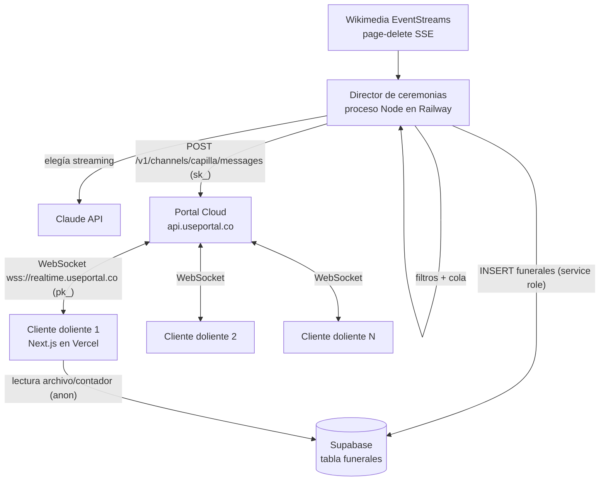

# Arquitectura técnica — Réquiem.wiki

Documento vivo. La integración con Portal está documentada con detalle porque es la
plataforma obligatoria del hackathon y un producto muy joven (SDK publicado en npm el
18-jul-2026, versiones 0.x): ante cualquier duda, la fuente es https://docs.useportal.co
(existe `docs.useportal.co/llms.txt` con el índice completo, y cada página tiene
versión markdown añadiendo `/index.md`).

---

## Stack seleccionado

| Capa | Tecnología | Justificación |
|------|-----------|---------------|
| Framework | Next.js 15 (App Router) + TypeScript | Velocidad con agentes de código, SSR para la portada, doc oficial de Portal tiene guía Next.js (`/core/ssr-and-nextjs`) |
| Tiempo real | **Portal** (`@portalsdk/core` + `@portalsdk/react`) | Obligatorio por bases y criterio de evaluación; cubre presencia, chat, ephemeral broadcasts y publicación server-side vía REST |
| IA | Claude API (Anthropic), streaming | Elegías generadas en vivo; una llamada corta por funeral |
| Fuente de datos | Wikimedia EventStreams `page-delete` (SSE público) | Verificado en vivo: ~4 borrados/min, ~1/min en ns=0; sin API key |
| Base de datos | Supabase Postgres (solo tabla `funerales`) | Archivo persistente y contador; MCP ya disponible; RLS simple |
| Estilos | Tailwind CSS v4 | Velocidad; el design system se implementa como tokens CSS |
| Despliegue web | Vercel | Zero-config para Next.js, MCP ya disponible |
| Despliegue director | Railway (proceso Node long-lived) | El director necesita vivir siempre (SSE + temporización de ceremonias); serverless no vale. Alternativas: Fly.io, o en local como plan B de demo |

---

## Diagrama de componentes



Dos piezas desplegables en un solo repo:

- **`apps/web`** — Next.js (Vercel): portada, capilla, toda la UI. Solo habla con
  Portal (pk_ pública) y lee Supabase (anon).
- **`apps/director`** — proceso Node long-lived (Railway): consume el SSE de
  Wikimedia, filtra, encola, temporiza ceremonias, pide elegías a Claude y publica el
  estado canónico en Portal vía REST con la clave secreta. Único escritor en Supabase.

---

## Estructura de carpetas

```
apps/
├── web/                      → Next.js (Vercel)
│   ├── app/                  → App Router: portada (/) y capilla (/capilla)
│   ├── components/           → Feretro, Velas, Flores, LibroCondolencias, Cola…
│   ├── lib/portal.ts         → Cliente Portal (módulo, singleton)
│   └── lib/supabase.ts       → Cliente anon para archivo/contador
├── director/                 → Proceso Node (Railway)
│   ├── src/wikimedia.ts      → Consumidor SSE page-delete + reconexión
│   ├── src/filtros.ts        → ns, redirects, sensibilidad, dedupe (con tests)
│   ├── src/cola.ts           → Cola de difuntos, capado, relajación, fosa común
│   ├── src/ceremonia.ts      → Máquina de estados del funeral (fases + timing)
│   ├── src/elegia.ts         → Claude streaming + elegía de respaldo
│   ├── src/portal.ts         → Publicación REST (sk_)
│   └── src/archivo.ts        → INSERT en Supabase (service role)
docs/                         → Esta documentación
```

(Monorepo pnpm con workspaces; si el overhead molesta, degradar a dos carpetas con
`package.json` propios sin workspace.)

---

## Integración con Portal (el corazón del proyecto)

### Modelo

- Cliente: `new Portal({ apiKey: NEXT_PUBLIC_PORTAL_KEY })` → WebSocket a
  `wss://realtime.useportal.co`. **Auth anónima** (cero backend): el visitante no se
  registra; su nombre de doliente viaja como presence metadata.
- Servidor (director): `POST https://api.useportal.co/v1/channels/{id}/messages` con
  `Authorization: Bearer ${PORTAL_SECRET}` y `senderId: "oficiante"`. Confirmado en la
  doc oficial (wire-protocol + setup prompt de useportal.co).

### Canal único `capilla`

| Mensaje | type | Persistente/ephemeral | Emisor | Contenido |
|---------|------|----------------------|--------|-----------|
| Estado del funeral | `funeral.estado` | Persistente (con `history` para late-joiners) | Solo director | id, fase, titulo, wiki, causa, hora_muerte, cola_tamano, velados_hoy |
| Trozo de elegía | `elegia.chunk` | **Ephemeral** (alta frecuencia) | Solo director | funeral_id, texto_acumulado (throttle ~400ms) |
| Elegía completa | `elegia.completa` | Persistente | Solo director | funeral_id, texto (≤2KB: elegías de 4–6 frases caben sobradas) |
| Flor/reacción | `reaccion` | **Ephemeral** | Dolientes | tipo (flor/vela/rezo), x |
| Condolencia | (default chat) | Persistente | Dolientes | texto ≤200 chars |
| Necrológica es | `necrologica.es` | Persistente | Solo director | titulo — los clientes la muestran como toast |

- **Presencia** (`useChannel` → `presence`): cada participante = una vela; metadata
  `{ nombre }` (≤1KB). Con sala grande Portal degrada a `aggregate` (solo count):
  la UI degrada a "N velas encendidas" sin nombres.
- **Notificaciones:** los usuarios anónimos tienen inbox de Portal permanentemente
  vacío, así que NO usamos el inbox: la necrológica es un mensaje normal del canal
  que el cliente pinta como toast + parpadeo del título de pestaña.
- **Reacciones:** Portal no trae API de reacciones prefabricada (el marketing lo
  sugiere; la doc lo desmiente) → se implementan como ephemeral sends, patrón de la
  guía oficial de live cursors.
- **Autoridad:** los tipos `funeral.*`, `elegia.*` y `necrologica.*` solo los publica
  el director. Se refuerza con middleware `onPublish` en `portal.config.ts`
  (bloquear esos types si el emisor no es el servidor) — si `portal deploy` diera
  problemas, el fallback es que los clientes ignoren esos types cuando
  `sender.id !== "oficiante"`.

### Estado para quien llega tarde

El late-joiner reconstruye con `history: 30`: el último `funeral.estado` +
`elegia.completa`/últimos `elegia.chunk` que le lleguen. El director publica
`funeral.estado` en cada cambio de fase (no por chunk), así el historial es compacto.

### Setup (una vez, vía CLI oficial)

```bash
pnpm dlx @portalsdk/cli login
pnpm dlx @portalsdk/cli projects create requiem-wiki
pnpm dlx @portalsdk/cli keys create --env <env-id> --type public    # pk_
pnpm dlx @portalsdk/cli keys create --env <env-id> --type secret    # sk_
pnpm dlx @portalsdk/cli origins add https://<dominio-vercel> --env <env-id>
```

⚠️ **`origins add` es obligatorio**: producción bloquea orígenes no registrados.
Registrar el dominio de Vercel (y previews si se usan) antes de la demo.

### Límites conocidos de Portal

- Contenido persistente ≤2KB; presence metadata ≤1KB; capacidad de canal con hard cap
  (429 `channel_at_capacity`, número no publicado).
- Producto de ~3 semanas: sin pricing publicado, sin página de status. Superficies
  reservadas que fallan en runtime: filtros `where` server-side, attachments.
- Estados de conexión del SDK: `idle/connecting/ready/reconnecting/degraded/blocked` —
  la UI de la capilla los refleja ("estás velando en silencio" si degrada).

---

## Estrategia de autenticación

Sin auth de usuarios, deliberadamente: Portal en modo anónimo (credencial anónima
estable entre refrescos que acuña el propio SDK). El nombre del doliente es presence
metadata, no identidad. Nada que proteger: no hay datos de usuario, no hay escrituras
de cliente fuera de chat/reacciones (rate-limited).

Secretos de servidor (solo en el director y en Vercel env): `PORTAL_SECRET`,
`ANTHROPIC_API_KEY`, `SUPABASE_SERVICE_ROLE_KEY`.

---

## Integraciones externas

- **Wikimedia EventStreams** (`stream.wikimedia.org/v2/stream/page-delete`): SSE
  público sin clave. Reconexión con backoff + `Last-Event-ID` para no perder muertes
  durante cortes. Verificado: ~4 borrados/min totales, ~1/min ns=0.
- **Claude API:** modelo rápido (Haiku 4.5) para elegías, streaming, `max_tokens`
  corto. Elegía de respaldo local si falla o tarda >10s.
- **Supabase:** tabla `funerales` (ver data-model.md). El director escribe con service
  role; la web lee con anon key (RLS: SELECT público).

---

## MCPs del proyecto

| Servidor | Alcance | Para qué se usa | Variables necesarias |
|----------|---------|-----------------|----------------------|
| supabase | user (ya configurado globalmente) | Crear tabla `funerales`, migraciones, logs | — (OAuth ya activo) |
| vercel | user (ya configurado globalmente) | Deploys, logs de build, dominios | — (OAuth ya activo) |

Portal **no tiene servidor MCP oficial** (verificado 08-ago-2026 en docs, GitHub y npm);
se opera con su CLI `@portalsdk/cli` + REST. No se añade ningún MCP nuevo al proyecto.

---

## Estrategia de despliegue

- **Rama única `main`** — no hay equipo, no hay PRs internos durante la carrera;
  commits pequeños y frecuentes (criterio del hackathon: commits dentro de ventana).
- **Web:** Vercel conectado al repo; cada push a main → producción. Deploy desde la
  hora 0.
- **Director:** Railway como servicio Node desde el mismo repo (root
  `apps/director`); auto-deploy en push. **Plan B de demo:** el director corre
  idéntico en local con `pnpm director:dev` (mismas env vars) — si Railway cae el
  domingo, se levanta en local en 1 minuto y los clientes no notan nada (ellos solo
  hablan con Portal).
- Variables por entorno documentadas en `.env.example`.

---

## Decisiones técnicas relevantes

### 2026-08-08 — Director como proceso long-lived, no serverless
**Contexto:** alguien tiene que consumir el SSE de Wikimedia 24/7, temporizar
ceremonias de ~45s y streamear elegías; las funciones serverless de Vercel no
sostienen procesos persistentes.
**Opciones consideradas:** (a) Vercel cron + funciones, (b) Cloudflare Durable
Objects, (c) Portal channel extensions, (d) proceso Node en Railway.
**Decisión:** (d). Las extensions de Portal solo reaccionan a mensajes del canal (no
pueden iniciar consumo de un SSE externo), Durable Objects añade curva en pleno
hackathon, y cron+serverless rompe el streaming letra a letra.
**Consecuencias:** una pieza más que desplegar, mitigada con el plan B local.

### 2026-08-08 — Canal único `capilla` con types namespaced
**Contexto:** Portal organiza todo en canales; podríamos separar estado/chat/reacciones
en canales distintos.
**Decisión:** un solo canal global con `type` por familia de mensaje. Menos sockets,
menos estados de conexión que gestionar, y el historial mezclado es exactamente lo que
un late-joiner necesita para reconstruir la escena.
**Consecuencias:** si el hard cap de capacidad del canal apareciera en la demo (429),
sería el problema más dulce posible; se documentaría sala de desbordamiento como mejora.

### 2026-08-08 — Elegía por chunks ephemeral + cierre persistente
**Contexto:** el streaming letra a letra es la escena central, pero saturar el
historial del canal con chunks lo rompería para late-joiners (y el contenido
persistente capa a 2KB).
**Decisión:** chunks `ephemeral: true` con texto acumulado (throttle ~400ms, quien
llega a mitad se engancha con el último chunk) + un `elegia.completa` persistente al
terminar.
**Consecuencias:** late-joiners a mitad de elegía ven aparecer el texto de golpe en el
siguiente chunk; aceptable y hasta litúrgico (llegas tarde al sermón).
