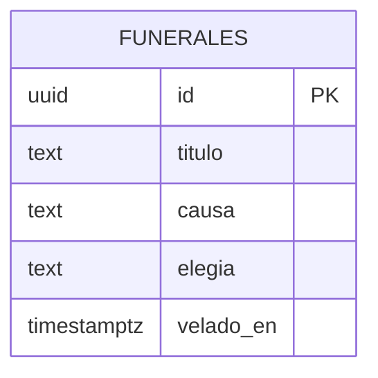

# Modelo de datos — Réquiem.wiki

Dos capas de datos con vidas distintas:

1. **Estado efímero en tiempo real (Portal):** el funeral en curso, presencia (velas),
   reacciones (flores) y libro de condolencias. Vive en los canales de Portal, no en
   base de datos. Su forma se documenta aquí porque es el contrato entre director y
   clientes.
2. **Registro persistente (Supabase Postgres):** el archivo de funerales celebrados —
   alimenta el contador del día, el obituario y el futuro "cementerio". Solo escribe el
   servidor (director); los clientes solo leen.

No hay usuarios persistentes: el doliente es un nombre efímero en la sesión.

---

## Capa efímera (Portal) — contrato de estado

### `funeral` (estado sincronizado canónico, solo lo publica el director)

| Campo | Tipo | Descripción |
|-------|------|-------------|
| id | string | Id del funeral (uuid del evento Wikimedia) |
| fase | `'procesion' \| 'elegia' \| 'duelo' \| 'cierre' \| 'espera'` | Fase de la ceremonia |
| titulo | string | Título del artículo difunto (con espacios, sin underscores) |
| wiki | string | p. ej. `es.wikipedia.org` |
| causa | string | Comentario real del administrador que borró |
| hora_muerte | timestamp | Cuándo se borró |
| elegia_parcial | string | Texto de la elegía escrito hasta ahora (streaming) |
| cola_tamano | number | Almas esperando velatorio |
| velados_hoy | number | Contador del día |

### `presencia` (Portal presence)

| Campo | Tipo | Descripción |
|-------|------|-------------|
| nombre | string | Nombre elegido por el doliente (≤30 chars, filtrado básico) |

### `reaccion` (evento efímero broadcast)

| Campo | Tipo | Descripción |
|-------|------|-------------|
| tipo | `'flor' \| 'vela' \| 'rezo'` | Qué cae sobre el féretro |
| x | number 0–1 | Posición horizontal aleatoria de caída (la decide el emisor) |

### `condolencia` (chat de Portal)

| Campo | Tipo | Descripción |
|-------|------|-------------|
| nombre | string | Autor |
| texto | string ≤200 | Mensaje del libro de condolencias |

---

## Capa persistente (Supabase)

### `funerales`

Archivo de todos los funerales celebrados. Escribe solo el director (service role).

| Campo | Tipo | Descripción |
|-------|------|-------------|
| id | uuid (PK) | Id del funeral |
| wiki | text | Base de datos wiki de origen (`eswiki`, `enwiki`…) |
| dominio | text | `es.wikipedia.org` |
| titulo | text | Título del artículo |
| ns | int | Namespace (0 = artículo; 118 = borrador si se relajó el filtro) |
| causa | text | Comentario real del borrado |
| usuario_admin | text | Quién lo borró (público en el stream) |
| hora_muerte | timestamptz | Timestamp del borrado en Wikimedia |
| elegia | text | Elegía completa generada |
| flores | int default 0 | Total de reacciones recibidas |
| dolientes_max | int default 0 | Máximo de velas simultáneas durante su duelo |
| velado_en | timestamptz default now() | Cuándo se celebró el funeral |
| ensayo | boolean default false | true si fue reproducido en modo ensayo (rodaje) |

Índices: `(velado_en desc)` para contador/obituario del día; `(wiki)` para stats por idioma.

---

## Relaciones entre entidades

Una sola tabla, sin relaciones: los dolientes no se persisten y el estado vivo es de
Portal. Deliberado — cada tabla extra es tiempo de hackathon.

---

## Políticas de acceso (RLS)

### `funerales`
- **SELECT:** público (anon) — el archivo es abierto por diseño.
- **INSERT/UPDATE/DELETE:** solo service role (el director en el servidor). Sin
  políticas para anon/authenticated: los clientes jamás escriben aquí.

---

## Migraciones

| Fecha | Archivo | Descripción |
|-------|---------|-------------|
| (pendiente) | 001_funerales.sql | Tabla `funerales` + índices + RLS |

---

## Datos seed

Ninguno. El sistema se alimenta solo del stream real de Wikimedia — la primera muerte
real llena la primera fila. (Requisito emocional: no inventamos difuntos.)

---

## Referencia: evento origen (Wikimedia `page-delete`)

Campos del stream que consumimos (verificado en vivo el 2026-08-08, ~4 borrados/min
totales, ~1/min en ns=0):

- `page_title`, `page_namespace`, `page_is_redirect`
- `database` (p. ej. `eswiki`), `meta.domain`, `meta.uri`, `meta.dt`
- `comment` (causa real del administrador), `performer.user_text`

Filtros de entrada a capilla: `page_namespace == 0`, `!page_is_redirect`, filtro de
sensibilidad (biografías de personas reales recientes, títulos ofensivos/vandálicos),
dedupe por `meta.id`.
