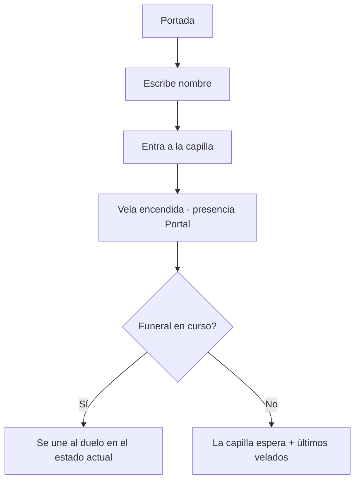
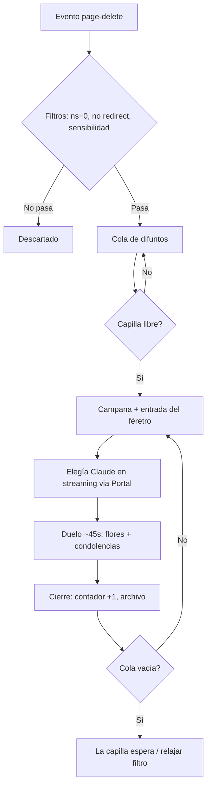

# Flujos de usuario — Réquiem.wiki

El PRD los describe narrativamente; este archivo entra en detalle con diagramas y
estados. Cada flujo tiene un ID referenciable desde código y PRD.

---

## [FLOW-01] — Entrar a la capilla

**Actor:** visitante (futuro doliente)
**Trigger:** llega a la URL raíz
**Resultado esperado:** está dentro de la capilla, su vela arde en la pantalla de todos

### Pasos

1. Portada mínima: "Cada minuto, Wikipedia borra conocimiento para siempre. Alguien
   tenía que velarlo." + input "Enciende tu vela" (nombre) + botón entrar.
2. Escribe un nombre (o acepta el sugerido, p. ej. "Doliente nº 47") y entra.
3. Transición a la capilla: su vela se enciende con flicker; los demás la ven aparecer.
4. Ve el funeral en curso en el estado exacto en que está (féretro actual + elegía ya
   escrita hasta ese punto), no desde el principio.
5. El primer gesto (clic/tap) desbloquea el audio (campana/órgano), con mute visible.

### Diagrama

### Casos de error

- Nombre vacío → se asigna "Doliente nº N".
- Portal no conecta → la capilla funciona en modo lectura (ve funerales) con aviso
  discreto "estás velando en silencio"; reintento automático.
- Nombre ofensivo evidente → filtro básico de lista negra, se sustituye por anónimo.

---

## [FLOW-02] — El funeral (bucle central del sistema)

**Actor:** el sistema (director de ceremonias) + todos los dolientes
**Trigger:** Wikimedia emite un borrado que pasa los filtros
**Resultado esperado:** el artículo es velado con elegía y duelo, y queda registrado

### Pasos

1. Evento `page-delete` llega al director → filtros: namespace artículo (ns=0), no
   redirect, filtro de sensibilidad (biografías recientes de personas reales, títulos
   con señales de vandalismo/ofensa).
2. Pasa → entra en la **cola de difuntos** (visible en la capilla).
3. Cuando termina el duelo anterior, el director toma el siguiente: campana, entrada
   procesional del féretro (~2s), título + wiki + causa de defunción real.
4. El director pide la elegía a Claude (streaming) y la retransmite letra a letra vía
   estado sincronizado de Portal — todos ven escribirse lo mismo a la vez.
5. Ventana de duelo (~45s): flores, condolencias, velas.
6. Cierre: fundido del féretro, +1 al contador del día, registro en el archivo.
7. Si la cola queda vacía → modo "la capilla espera" (se relaja el filtro a borradores
   abandonados si la espera supera ~2 min).

### Diagrama

### Casos de error

- Stream de Wikimedia caído → reconexión con backoff; la cola amortigua; si se agota,
  modo espera con últimos velados.
- Claude falla o tarda >10s → elegía de respaldo de plantilla ("Descanse en paz. Ni
  las fuentes fiables pudieron salvarle.") y el funeral continúa.
- Borrado masivo (admin borra 50 páginas en un minuto) → la cola capa a N visibles y
  el resto se registra sin velatorio individual ("fosa común" en el contador).

---

## [FLOW-03] — Participar en el duelo

**Actor:** doliente
**Trigger:** hay un funeral en curso
**Resultado esperado:** su participación es visible para todos al instante

### Pasos

1. **Flores:** tap en 🌹/🕯️/🙏 → la flor cae sobre el féretro en todas las pantallas
   (<300ms percibidos). Sin límite duro, con rate-limit suave por usuario.
2. **Condolencia:** escribe en el libro ("descanse en paz, lista de Pokémon falsos") →
   aparece en el panel de todos con su nombre.
3. **Presencia pasiva:** aunque no haga nada, su vela arde y cuenta — estar es
   participar.

### Casos de error

- Mensaje demasiado largo → recorte a 200 caracteres.
- Spam → rate-limit por usuario (1 mensaje/5s, ráfagas de flores capadas).

---

## [FLOW-04] — Notificación de muerte en tu idioma

**Actor:** doliente con la pestaña abierta (incluso en segundo plano)
**Trigger:** muere un artículo de es.wikipedia
**Resultado esperado:** el doliente vuelve a la capilla a tiempo para el velatorio

### Pasos

1. El director detecta `database == "eswiki"` en un evento aceptado.
2. Publica notificación vía Portal: "Ha muerto un artículo en tu idioma: «{título}»".
3. El cliente la muestra (toast in-app; título de pestaña parpadea "✝ Ha muerto un
   artículo").
4. Clic → foco en la capilla, funeral en curso.

### Casos de error

- Muchas muertes es.wiki seguidas → agrupar ("3 artículos en español esperan velatorio").

---

## [FLOW-05] — La demo de 90 segundos (flujo de rodaje)

**Actor:** nosotros, grabando
**Trigger:** vídeo requerido por las bases
**Resultado esperado:** vídeo entregable según guion del PRD

Escenas: campana sobre negro y claim (0–10s) → féretro real entrando con timestamp
(10–25s) → elegía escribiéndose en vivo con velas ardiendo (25–45s) → pantalla partida
con 3 dispositivos: flores caen sincronizadas y el libro de condolencias se mueve
(45–65s) → notificación "ha muerto un artículo en español" en un móvil y entrada al
velatorio (65–80s) → contador del día + claim final + logo (80–90s).

Plan B de rodaje: si en el momento del rodaje el ritmo de borrados reales es bajo, se
rueda sobre el entorno de staging con el "modo ensayo" del director (reproduce borrados
reales de la última hora, marcados internamente como ensayo; nunca se inventa contenido).
